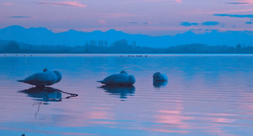
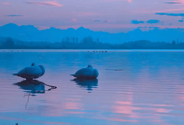

# OmnimatteZeroEfficient

**Training-free video matting, object removal, and layer composition — optimized for Apple Silicon.**

Based on [OmnimatteZero](https://github.com/dvirsamuel/OmnimatteZero) by Samuel et al., this project re-engineers the pipeline to run on Apple M-series chips with ~22 GB unified memory. If you have a 24 GB MacBook Pro (M4 Pro / M4 Max), this will run out of the box — no NVIDIA GPU required.

[](https://arxiv.org/abs/2503.18033)
[](https://dvirsamuel.github.io/omnimattezero.github.io/)
[](https://github.com/Ak-Gautam)
[](https://x.com/Gautam_A_k)

---

## Example: Object Removal

<table>
<tr>
<td align="center"><strong>Input</strong></td>
<td align="center"><strong>Result</strong></td>
</tr>
<tr>
<td></td>
<td></td>
</tr>
<tr>
<td align="center"><em>Three swans on a lake</em></td>
<td align="center"><em>Swans and reflections removed</em></td>
</tr>
</table>

---

## What This Project Adds

The original OmnimatteZero requires a 32 GB+ CUDA GPU. This project makes it practical on consumer Apple Silicon hardware:

- **MPS backend support** — runs natively on Apple M-series GPUs via PyTorch MPS
- **Unified memory-aware configuration** — tuned for the ~65% of unified memory actually available to ML workloads after macOS overhead
- **Prompt embedding cache** — caches T5 encoder outputs to disk, so repeat runs skip the expensive text encoder entirely
- **Tiered memory presets** — pre-configured profiles for `mps_24gb`, `16gb`, `24gb`, and `32gb` VRAM targets
- **Attention slicing** — critical for MPS memory constraints
- **Model CPU offload** — leverages unified memory architecture for efficient offloading
- **VAE float32 enforcement** — prevents numerical instability on MPS/FP16
- **Cross-platform device abstraction** — auto-detects CUDA, MPS, or CPU and applies the right dtypes and generator handling

All three pipeline stages work on Apple Silicon: object removal, self-attention mask generation, and foreground composition.

---

## Requirements

- Python 3.8+
- PyTorch 2.4+
- Apple Silicon Mac with 24 GB unified memory (M4 Pro, M4 Max, M3 Pro, M3 Max, etc.)
  - Also works on CUDA GPUs (16 GB+ VRAM)
- ~6 GB disk space for the LTX-Video 2B model checkpoint

## Installation

```bash
git clone https://github.com/Ak-Gautam/OmnimatteZeroEfficient.git
cd OmnimatteZeroEfficient

python -m venv venv
source venv/bin/activate

pip install -r requirements.txt
```

Download the [LTX-Video 2B v0.9.5](https://huggingface.co/Lightricks/LTX-Video) checkpoint and place it in `model_checkpoint/`:

```
model_checkpoint/
└── ltx-video-2b-v0.9.5.safetensors
```

---

## Quick Start

### Data Layout

Place your input videos under `example_videos/`:

```
example_videos/
└── your_video/
    ├── video.mp4           # original video
    ├── object_mask.mp4     # binary mask of the object (white = object)
    └── total_mask.mp4      # mask of object + effects (shadows, reflections)
```

Generate masks with [SAM2](https://github.com/facebookresearch/segment-anything-2) or use the built-in self-attention mask generator (see below).

---

## Object Removal

Remove an object and its associated effects (shadows, reflections) from a video.

```bash
# Apple Silicon (recommended)
python object_removal.py \
  --preset mps_24gb \
  --video three_swans_lake \
  --height 480 --width 704 --num_frames 97 \
  --use_prompt_cache

# With model CPU offload (lower peak memory)
python object_removal.py \
  --preset mps_24gb \
  --video three_swans_lake \
  --height 480 --width 704 --num_frames 97 \
  --use_prompt_cache --offload model

# Minimum memory (slowest)
python object_removal.py \
  --preset mps_24gb \
  --video three_swans_lake \
  --height 480 --width 704 --num_frames 97 \
  --use_prompt_cache --offload sequential
```

**CUDA GPUs:**

```bash
# 16 GB VRAM
python object_removal_optimized.py --preset 16gb --video three_swans_lake

# 24 GB VRAM
python object_removal_optimized.py --preset 24gb --video three_swans_lake

# 32 GB+ VRAM
python object_removal.py --preset 32gb --video three_swans_lake
```

Output is saved to `results/<video_name>.mp4`.

### Key Options

| Flag | Description |
|------|-------------|
| `--video` | Folder name under `example_videos/` |
| `--preset` | Memory preset: `mps_24gb`, `16gb`, `24gb`, `32gb` |
| `--checkpoint` | Path to model checkpoint (default: `model_checkpoint/ltx-video-2b-v0.9.5.safetensors`) |
| `--height`, `--width` | Output resolution (MPS target: 480x704) |
| `--num_frames` | Frame count (MPS target: 97 = ~4s at 24fps) |
| `--use_prompt_cache` | Cache T5 embeddings to `cached_embeddings/` |
| `--offload` | CPU offload mode: `auto`, `none`, `model`, `sequential` |
| `--num_inference_steps` | Quality/speed tradeoff (default: 30) |

---

## Self-Attention Mask Generation

If you only have an `object_mask.mp4`, generate the `total_mask.mp4` (object + effects) automatically using the diffusion model's self-attention:

```bash
python self_attention_map.py \
  --video_folder ./example_videos/three_swans_lake \
  --height 480 --width 704 \
  --preset mps_24gb \
  --use_prompt_cache
```

**How it works:** The video is encoded to latent space, noise is injected, and a forward pass extracts self-attention maps from all 48 transformer layers. Regions that attend strongly to the object (like its shadow or reflection) are identified and merged into the total mask.

| Parameter | Default | Description |
|-----------|---------|-------------|
| `--video_folder` | (required) | Folder with `video.mp4` and `object_mask.mp4` |
| `--height`, `--width` | 512, 768 | Processing resolution |
| `--threshold` | adaptive | Attention threshold (`None` = mean + 0.5*std) |
| `--dilation` | 3 | Morphological dilation kernel size |

Output: `total_mask.mp4` is written to the input folder.

For sharper boundaries, use the generated mask as a prompt for [SAM2](https://github.com/facebookresearch/segment-anything-2).

---

## Foreground Extraction & Composition

Extract the foreground layer and composite it onto a new background:

```bash
python foreground_composition.py \
  --video_folder three_swans_lake \
  --new_bg ./results/cat_reflection.mp4 \
  --height 480 --width 704 \
  --use_prompt_cache
```

**How it works:**

1. Encode the original video and the clean background (from object removal) to latent space
2. Compute the foreground: `z_foreground = z_original - z_background`
3. Pixel-inject the object region for fine detail preservation
4. Add to the new background: `z_composite = z_new_bg + z_foreground`
5. Refine with a few noising-denoising steps

**Output:**

```
results/
├── <video>_foreground.mp4        # extracted foreground layer
├── <video>_latent_addition.mp4   # before refinement
└── <video>_refined.mp4           # final composition
```

---

## Memory Presets

| Preset | Target | Resolution | Max Frames | Notes |
|--------|--------|------------|------------|-------|
| `mps_24gb` | Apple Silicon 24 GB | 704x480 | 97 | Attention slicing, model CPU offload, FP16 |
| `16gb` | CUDA 16 GB | 704x480 | 97 | FP8 casting, group offloading, sequential CPU offload |
| `24gb` | CUDA 24 GB | 768x512 | 121 | FP8 casting, group offloading, model CPU offload |
| `32gb` | CUDA 32 GB+ | 768x512 | 161 | VAE tiling only |

The `mps_24gb` preset accounts for macOS using ~35% of unified memory, leaving ~15.6 GB effective for ML workloads. It disables FP8 casting and group offloading (unsupported on MPS) and relies on attention slicing + model CPU offload instead.

---

## Tips

- **First run is slower** — the T5 text encoder must run once. Use `--use_prompt_cache` so subsequent runs skip it entirely.
- **Start with the preset defaults** for resolution and frame count. Increase only if you have headroom.
- **Shorter clips** process faster and use less memory. Split long videos into segments if needed.
- **`--offload sequential`** uses the least memory but is noticeably slower than `--offload model`.
- **Monitor memory** on macOS with Activity Monitor or `sudo powermetrics --samplers gpu_power`.

---

## Note on Attention Guidance

The original paper describes Temporal and Spatial Attention Guidance using TAP-Net. The current codebase uses LTX-Video 0.9.5/0.9.7, which achieves good results without explicit attention guidance. The guidance implementation is available in `attention_guidance.py` for reference.

---

## Credits

This project builds directly on **OmnimatteZero** by Dvir Samuel, Matan Levy, Nir Darshan, Gal Chechik, and Rami Ben-Ari (Samsung AI Center / Bar-Ilan University). All credit for the core method — latent conditioning, self-attention mask generation, and latent arithmetic for foreground composition — belongs to them.

**Original repository:** [github.com/dvirsamuel/OmnimatteZero](https://github.com/dvirsamuel/OmnimatteZero)

If you use this work, please cite the original paper:

```bibtex
@inproceedings{samuel2025omnimattezero,
  author    = {Dvir Samuel and Matan Levy and Nir Darshan and Gal Chechik and Rami Ben-Ari},
  title     = {OmnimatteZero: Fast Training-free Omnimatte with Pre-trained Video Diffusion Models},
  booktitle = {SIGGRAPH Asia 2025 Conference Papers},
  year      = {2025}
}
```

### Other Acknowledgments

- [LTX-Video](https://github.com/Lightricks/LTX-Video) — base video diffusion model
- [Diffusers](https://github.com/huggingface/diffusers) — diffusion pipeline infrastructure
- [TAP-Net](https://github.com/google-deepmind/tapnet) — point tracking (reference)

---

Built by [Ak-Gautam](https://github.com/Ak-Gautam) | [Twitter/X](https://x.com/Gautam_A_k)
